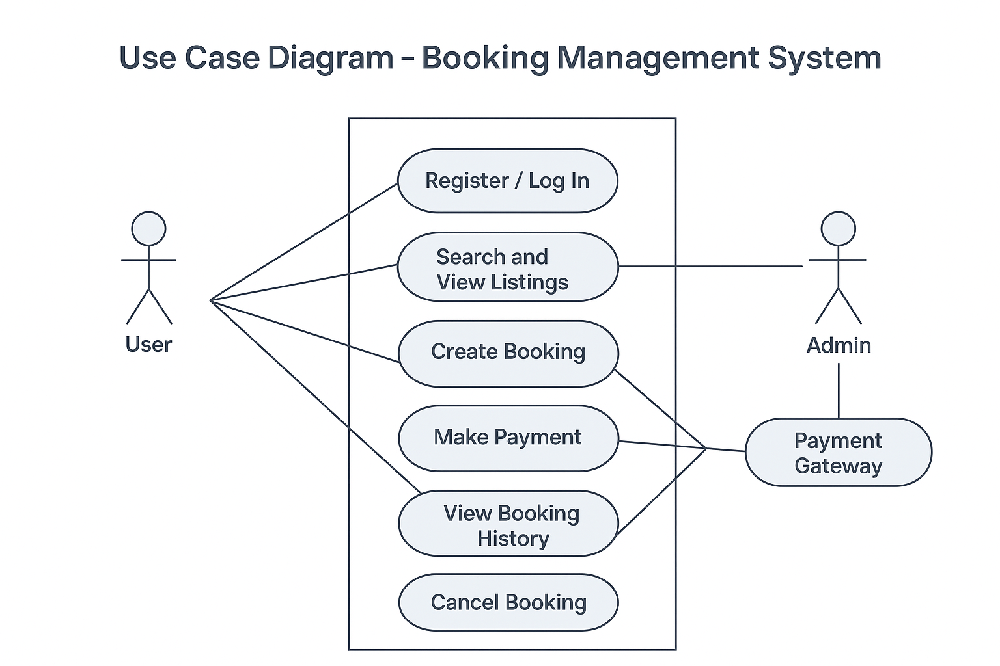

# Requirement Analysis in Software Development

## Introduction

Welcome to the **Requirement Analysis** project repository.  
This repository serves as a learning and reference resource for understanding one of the most critical phases in software development — **Requirement Analysis**.

In the Software Development Life Cycle (SDLC), the success of any project heavily depends on how well the requirements are gathered, understood, and documented. Requirement analysis bridges the gap between stakeholders’ expectations and the technical implementation carried out by developers. It ensures that every feature built serves a clear purpose and aligns with the overall project objectives.

This repository is designed to provide insights, explanations, and practical examples of how requirement analysis is conducted in real-world software development. It highlights the importance of communication, documentation, and validation in building reliable and user-centered software systems.

---

## What is Requirement Analysis?

**Requirement Analysis** is the process of identifying, gathering, and documenting the needs and expectations of stakeholders for a software system. It is the foundation upon which the entire software development process is built.

During this phase, project teams work closely with clients, end-users, and other stakeholders to understand *what the system should do* and *why it is needed*. The goal is to ensure that the development team has a clear, complete, and agreed-upon understanding of the requirements before actual design or coding begins.

### Importance of Requirement Analysis in SDLC

Requirement analysis is a crucial step in the **Software Development Life Cycle (SDLC)** because it:

- **Defines clear project objectives:** It ensures that the goals and functions of the software are well-understood before development starts.  
- **Reduces misunderstandings:** By documenting requirements precisely, it minimizes communication gaps between stakeholders and developers.  
- **Saves time and cost:** Identifying requirements early prevents costly rework during later stages of development.  
- **Improves software quality:** When requirements are well-defined, the resulting product better meets user expectations and business needs.  
- **Provides a solid foundation for design and testing:** Clear requirements guide the design of system architecture and help in creating effective test cases.

---

## Why is Requirement Analysis Important?

Requirement Analysis is important because it lays the groundwork for the entire software development process. Without a clear understanding of what the system should accomplish, the project is at risk of failure. Below are three key reasons why Requirement Analysis is critical in the SDLC:

1. **Prevents Miscommunication and Scope Creep**  
   By clearly defining project goals and user needs, requirement analysis prevents misunderstandings between stakeholders and developers. This ensures that everyone agrees on what will be delivered, reducing the chances of scope changes during development.

2. **Enhances Project Planning and Estimation**  
   Well-defined requirements allow project managers to estimate time, resources, and costs accurately. This leads to more realistic timelines and budgets, helping teams deliver on schedule and within scope.

3. **Improves Software Quality and User Satisfaction**  
   A thorough requirement analysis ensures that the product meets user expectations and business objectives. It helps developers build features that solve real problems, resulting in higher user satisfaction and a more valuable product.

4. **Reduces Rework and Development Costs**  
   Identifying and fixing requirement-related issues early is much cheaper than making corrections during or after implementation. This makes requirement analysis one of the most cost-effective stages in the SDLC.

---

## Key Activities in Requirement Analysis

Requirement Analysis involves several structured activities that help transform vague ideas into well-defined, actionable requirements. The five key activities are:

- **Requirement Gathering**  
  Collecting information from stakeholders through interviews, questionnaires, observations, or workshops. This helps understand what users expect from the system.

- **Requirement Elicitation**  
  Engaging deeply with stakeholders to uncover hidden, unclear, or conflicting needs. Techniques like brainstorming, prototyping, and use case analysis are often used.

- **Requirement Documentation**  
  Organizing and recording all gathered information in a clear and structured form, usually as a *Software Requirements Specification (SRS)* document.

- **Requirement Analysis and Modeling**  
  Studying, refining, and representing requirements using models, diagrams, or flowcharts to visualize how the system should function and how components will interact.

- **Requirement Validation**  
  Reviewing the documented requirements with stakeholders to ensure they are complete, correct, and feasible before moving to the design phase.

---

## Types of Requirements

Requirements in software development are broadly categorized into two main types: **Functional Requirements** and **Non-functional Requirements**. Both are equally important for creating a complete and reliable system.

### Functional Requirements

**Definition:**  
Functional requirements describe *what the system should do*. They define the specific behaviors, features, and functions that the software must perform to meet business needs.

**Examples (for a Booking Management Project):**
- The system shall allow users to **create, update, and cancel bookings**.  
- The system shall send **email confirmations** to users after successful bookings.  
- The admin shall be able to **view all bookings and manage availability**.  
- Users shall be able to **search for available dates and rooms** based on their preferences.  
- The system shall generate **booking invoices and payment receipts** automatically.

### Non-functional Requirements

**Definition:**  
Non-functional requirements define *how the system should perform* rather than what it should do. They specify quality attributes, performance constraints, and usability expectations.

**Examples (for a Booking Management Project):**
- The system shall have a **response time of less than 3 seconds** for any user request.  
- The application shall maintain **99.9% uptime** to ensure high availability.  
- User data shall be **encrypted** to maintain security and privacy.  
- The system shall support **up to 10,000 concurrent users** without performance degradation.  
- The interface shall be **mobile-responsive and accessible** to users with disabilities.

---

## Use Case Diagrams

**Use Case Diagrams** are a visual tool used in Requirement Analysis to describe how users (actors) interact with a system. They show *who* uses the system and *what* they can do within it. This helps stakeholders understand the system’s scope, boundaries, and user interactions clearly.

### Benefits of Use Case Diagrams

- Provide a **clear visualization** of system functionality.  
- Help identify **actors**, **use cases**, and **system boundaries** early in development.  
- Improve **communication** between developers, testers, and stakeholders.  
- Serve as a foundation for writing **test cases** and **user stories**.  

### Example: Booking Management System Use Case Diagram

Below is a use case diagram representing the major actors and use cases for the booking management system.  

**Actors:**  
- User  
- Admin  
- Payment Gateway  

**Use Cases:**  
- Register / Log In  
- Search and View Listings  
- Create Booking  
- Make Payment  
- View Booking History  
- Cancel Booking  
- Manage Bookings (Admin)  
- Generate Reports (Admin)  

> **Note:** The image `alx-booking-uc.png` is created using a diagram tool like Draw.io, Lucidchart, or Figma, then exported and saved in this repository.

---

## Acceptance Criteria

**Acceptance Criteria** are a set of predefined conditions that a software feature must meet to be considered complete and acceptable by the client or product owner. They define the boundaries of a user story and ensure that everyone understands what “done” means for a particular feature.

### Importance of Acceptance Criteria

- **Ensures Clarity:** They make it clear what functionality is expected from each feature.  
- **Facilitates Testing:** QA teams use them to verify whether the implemented feature meets the required behavior.  
- **Reduces Ambiguity:** They help developers and stakeholders align on what is acceptable for delivery.  
- **Improves Quality:** Acceptance criteria ensure that features are tested and validated before deployment.  

### Example: Checkout Feature in Booking Management System

**User Story:**  
As a user, I want to complete my booking by checking out securely so that my payment and reservation are confirmed.

**Acceptance Criteria:**
1. The user must be logged in to access the checkout page.  
2. The checkout page must display the booking summary, including room details, total price, and selected dates.  
3. The system must allow the user to choose a payment method (credit card, PayPal, etc.).  
4. The system must validate the payment details before submission.  
5. Upon successful payment, the system should:  
   - Display a confirmation message.  
   - Send a confirmation email to the user.  
   - Update the booking status to “Confirmed.”  
6. If payment fails, the system should display an error message and allow the user to retry.  

---

## Summary

Requirement Analysis is the cornerstone of successful software development. It helps transform user needs into actionable technical specifications, ensuring that the final product delivers true value.  
By understanding what the system should do (functional) and how it should perform (non-functional), teams can design, build, and deliver high-quality software that meets stakeholder expectations efficiently.
